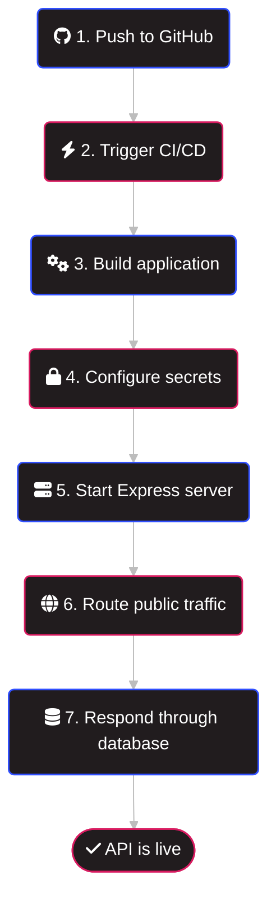

# Part 1: Deployment Concepts & Fundamentals

## 1. What is deployment?

**Answer:** Deployment is moving your backend from your own computer to a server that is always on and has a public URL, so other people and apps can use it. It is necessary because without it, no frontend, mobile app, or user can reach your API. A production app also needs HTTPS, stability, and the ability to handle many users at once.

## 2. The Deployment Process

What actually happens behind the scenes during the deployment process—from pushing your code to GitHub to your API successfully responding to a request on the web?

**Answer:**

| Step | Stage     | Description                                                                                                                                    |
| ---- | --------- | ---------------------------------------------------------------------------------------------------------------------------------------------- |
| 1    | Push      | You push your code to GitHub.                                                                                                                  |
| 2    | Trigger   | The hosting platform (e.g. Render, Railway) detects the new commit and starts a deployment automatically (CI/CD).                              |
| 3    | Build     | The platform clones the repo and runs `npm install` plus any build steps (e.g. `prisma generate`).                                             |
| 4    | Configure | Secrets such as `DATABASE_URL` and `JWT_SECRET` are injected as environment variables. They are never committed to GitHub.                     |
| 5    | Start     | The platform runs `npm start`, and Express listens on the port given in `process.env.PORT`.                                                    |
| 6    | Route     | The platform assigns a public URL, adds an HTTPS certificate, and uses a reverse proxy to forward incoming requests to your app.               |
| 7    | Respond   | A request travels from the client through DNS and the platform to Express, then to the database, and the response returns along the same path. |

## 3. The Localhost Limitation

Why is running an application on `localhost` (or leaving your personal computer running 24/7) unsuitable for real-world users?

**Answer:**

- localhost points to the user's own machine, so nobody else can reach your app.
- A personal computer sleeps, restarts, and loses internet, so the API goes offline.
- Home networks have changing IPs and are not meant to accept public traffic.
- Exposing a personal computer to the internet is a security risk.
- One laptop cannot scale to many users and has no backups, monitoring, or automatic restarts.

## 4. Separation of Concerns

Why is it an industry standard to host your server code (Express) and your database (PostgreSQL or MongoDB) on separate managed services in production, rather than together on the same server?
**Answer:**

- Independent scaling: You can add more servers for traffic or upgrade the database for storage, without affecting the other. //獨立擴充
- Data persistence: Many app servers are ephemeral and reset on each redeploy, so data stored on the same server could be lost. //資料持久性
- Security: A managed database can restrict access to trusted sources only, instead of being exposed to the whole internet.
- Managed reliability: Services like MongoDB Atlas, Supabase, and Neon provide automatic backups, monitoring, and recovery.
- Fault isolation: If the server crashes or is redeployed, the data stays safe, and database maintenance does not require touching app code.
- Resource competition: The database and the API compete for RAM, CPU, and disk I/O when they share one machine.

//比喻： 餐廳的廚房 (server) 和冷凍倉庫 (database) 分開。廚房失火重建，倉庫的食材仍然安全。倉庫也有專人管理溫度和備份。

## Part 2: Platform Landscape & Student Options

### 1. Platform Research

Research at least **two** backend application hosting platforms (e.g., Render, Railway, Fly.io, Vercel, Koyeb) and **two** Database-as-a-Service (DBaaS) providers (e.g., MongoDB Atlas, Neon, Supabase, Aiven).

_What specific free tiers do they offer for a Node.js + Mongoose/Prisma stack?_

**Answer:**

#### Hosting Platforms

- **Render:** The free web service has 512 MB RAM and 0.1 CPU, with 750 free instance hours per month. It spins down after 15 minutes of inactivity, and cold starts take 30 to 60 seconds. Its free PostgreSQL database expires after 30 days, so pairing it with an external DBaaS is better.
- **Railway:** New accounts get a one-time $5 trial credit. After the trial it reverts to a Free plan with $1 of credit per month. Sources disagree on this, so verify on the official pricing page.

#### Database-as-a-Service Providers

- **MongoDB Atlas (Mongoose):** The free cluster gives 512 MB of storage and up to 500 connections, with no time limit. It has no backups and no credit card is required.
- **Neon (Prisma/PostgreSQL):** The free plan includes 0.5 GB storage and 100 CU-hours per month per project, and compute scales to zero after 5 minutes idle.
- **Supabase (Prisma/PostgreSQL):** The free plan includes two active projects with 500 MB database each. Projects pause after one week of inactivity.

#### Recommended Stacks

- **Express/Mongoose:** Render + MongoDB Atlas
- **Express/Prisma:** Render + Neon

### 2. Cost Analysis

Compare the costs and pricing models for these platforms once free limits are exceeded or if a credit card is required.

_Which options are the safest for students wanting to avoid unexpected charges?_

**Answer:**

#### Pricing Comparison

| Platform      | Pricing model       | After free limits                                                  |
| ------------- | ------------------- | ------------------------------------------------------------------ |
| Render        | Fixed per instance  | Starter web service: $7/month                                      |
| Railway       | Usage-based         | Hobby includes $5 of usage per month; extra usage is billed on top |
| MongoDB Atlas | Per cluster tier    | Shared M2/M5: $9 to $25/month; dedicated M10: about $57/month      |
| Neon          | Usage-based         | $0.106 per CU-hour and $0.35 per GB-month, with no monthly minimum |
| Supabase      | Fixed plus overages | Pro: $25/month per organization                                    |

#### Safest Options for Students

Options that need no credit card cannot charge you. Atlas, Neon, and Supabase free plans require no card, and Neon does not bill overages on its Free plan; it stops the service instead. Render's free hosting also needs no credit card. Usage-based platforms like Railway carry the highest risk of unexpected charges once a card is attached.

## Part 3: Understanding Free Tier Limits in Plain English

Hosting platforms have technical limits on their free tiers. Explain in simple, layperson terms what each of the following technical resource limits means, and describe the real-world impact on an end-user when that limit is hit.

### 1. RAM / Memory Limits （記憶體，例如 512 MB）

**Example:** 512 MB

**Answer:**

**Plain English:** RAM is the app's working desk. A bigger desk lets it handle more at once.

**Impact when hit:** The app gets killed and restarted. Users see slow pages, failed requests, or 500/502 errors.

### 2. Cold Starts / Sleep Cycles / Inactivity Timeouts （休眠與冷啟動）

**Example:** The server "spins down" after 15 minutes of non-use.

**Answer:**

When nobody uses the app, the platform shuts it down to save resources and restarts it on the next request. On Render's free tier this happens after 15 minutes idle, and startup takes about 30 to 60 seconds.

**Impact when hit:** The first visitor waits close to a minute and may think the site is broken. Later requests are fast.

### 3. Compute Hours & CPU Quotas （運算時數）

**Example:** 750 free execution hours per month.

**Answer:**

This is the monthly "opening hours" budget. 750 hours covers one always-on service for the whole month, but multiple services share it. Neon measures database compute as 100 CU-hours per month on its free plan.

**Impact when hit:** Render suspends free services until the next month, and Neon suspends compute until the next billing period. The site is offline, but data is not deleted.

### 4. Database Storage & Active Connection Limits （資料庫儲存與連線數）

**Scope:** Include research on how ORMs like Prisma or Mongoose impact maximum database connections.

**Answer:**

**Plain English:** Storage is how much data the database can hold (Atlas free: 512 MB, Neon free: 0.5 GB). A connection is one open line between the app and the database; Atlas free allows up to 500 at once.

**ORM impact:** ORMs keep a pool of reusable connections. Mongoose defaults to `maxPoolSize` 100. Prisma v6 defaults to `num_cpus * 2 + 1` per PrismaClient instance, and Prisma v7 with the `pg` adapter defaults to 10. In serverless setups every function instance has its own pool, so connections multiply quickly. Prisma recommends starting with `connection_limit=1` there, or using an external pooler such as PgBouncer. On a small free database, lower Mongoose's `maxPoolSize` (e.g., 10) and create only one PrismaClient instance.

**Impact when hit:** Storage full means writes fail (sign-ups, orders) while reading still works. Too many connections means requests queue, time out (e.g., Prisma's pool timeout error), or fail randomly.

### 5. Outbound Data Transfer / Bandwidth （對外流量）

**Example:** 5 GB/month.

**Answer:**

This is the total amount of data your server sends to users each month (pages, images, JSON). Supabase's free plan includes 5 GB of egress, and Neon's includes 5 GB of public network transfer per project.

**Impact when hit:** Depending on the provider, the service is restricted or paused, so images or data stop loading. Some platforms, such as Render, bill overages ($0.15/GB), which is a real cost risk.
